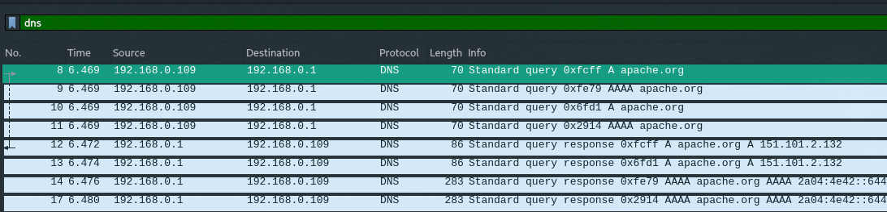
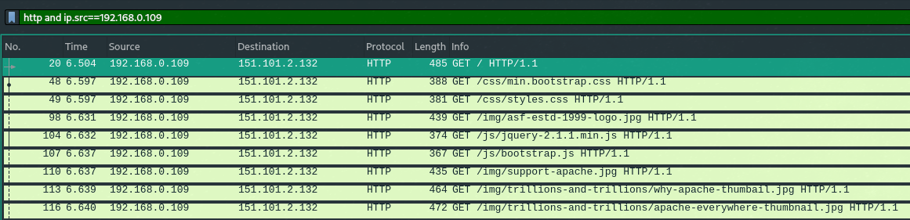
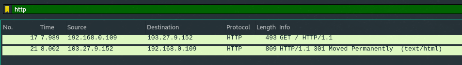
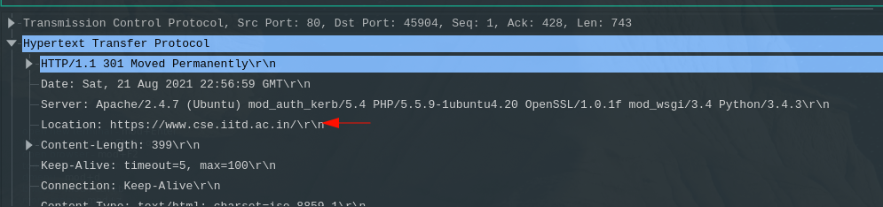
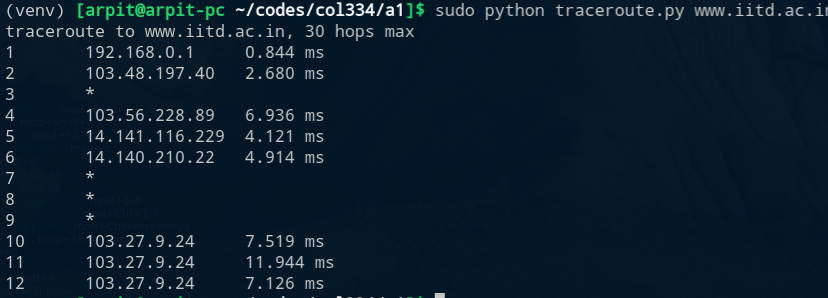
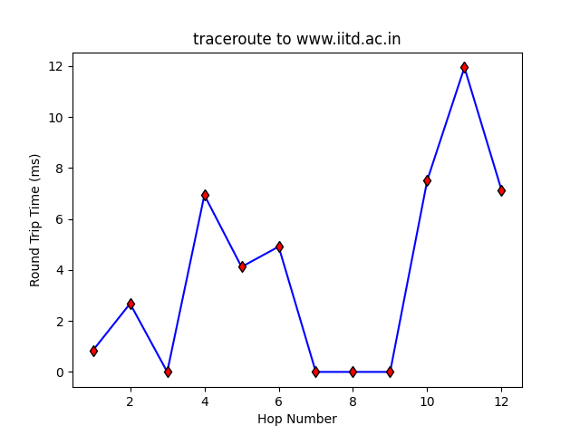

## Question 1: Networking Tools

(a) The IP address of my machine (specifically, the WiFi interface) is `192.168.0.109`.

    If I connect to a mobile hotspot instead, which uses a different ISP, the IP address changes to `192.168.37.181`. I will also note that changing the SIM card providing internet on the mobile phone whose hotspot I connect to does not result in a change in the IP address.

(b) To find the IP address of `www.google.com`, I ran `nslookup www.google.com`. The output was:

    ```
    Server:		192.168.0.1
    Address:	192.168.0.1#53

    Non-authoritative answer:
    Name:	www.google.com
    Address: 172.217.167.196
    Name:	www.google.com
    Address: 2404:6800:4002:80d::2004
    ```

    This means the DNS server used was `192.168.0.1` (which is the address of my WiFi router) and the IP (v4) address for `www.google.com` was reported as `172.217.167.196`.

    Running the same for `www.facebook.com`, the IP address I get is `157.240.198.35`. I'm not adding the entire output for the sake of brevity.

    I've looked up some open DNS servers and the results are summarised in the table below along with the default nameserver[^defaultns] that `nslookup` used:

    [^defaultns]: The default has the IP address of my router, which is configured to "Attain DNS Automatically" and is probably using one provided by the ISP

    DNS provider  | DNS Server address | IP address for `www.google.com` | IP address for `www.facebook.com`
    --------------|--------------------|---------------------------------|----------------------------------
    (Default)     | 192.168.0.1        | 172.217.167.196                 | 157.240.198.35
    Cisco OpenDNS | 208.67.222.222     | 142.250.193.19                  | 157.240.239.35
    Cloudflare    | 1.1.1.1            | 216.58.203.36                   | 157.240.16.35
    Google        | 8.8.8.8            | 142.250.77.196                  | 157.240.239.35
    Quad9         | 9.9.9.9            | 172.217.26.132                  | 157.240.13.35

    Table: DNS lookups using different DNS servers

    It is interesting to note that all the responses we got above said "Non-authoritative answer". This means that the response came from a DNS server that was not the authoritative DNS server for that domain.

    To find the authoritative DNS servers, we can query the NS records of the domain using the `host` command. For example, running it for `google.com`, we get:

    ```bash
$ host -t ns google.com
google.com name server ns1.google.com.
google.com name server ns4.google.com.
google.com name server ns3.google.com.
google.com name server ns2.google.com.
    ```

    Similarly, we get name servers `a.ns.facebook.com` to `d.ns.facebook.com` for the domain `facebook.com`.

    Using these authoritative DNS server `ns1.google.com`, the IP address obtained for `www.google.com` is `142.250.192.228`.

    Using the Facebook authoritative DNS servers gives a very interesting response:

    ```bash
    $ nslookup www.facebook.com a.ns.facebook.com
    Server:		a.ns.facebook.com
    Address:	129.134.30.12#53

    www.facebook.com	canonical name = star-mini.c10r.facebook.com.
    ```

    So, it doesn't yield an IP address, but rather gives us a canonical name. Upon further investigation, it is coming from the CNAME record of `www.facebook.com`. So, `star-mini.c10r.facebook.com` is an alias of `www.facebook.com` and we need the IP address (A record) of the former. Unfortunately, the server `a.ns.facebook.com` can't find it. So we look for the NS record of it, which gives us authoritative nameservers as `a.ns.c10r.facebook.com` to `d.ns.c10r.facebook.com`. Querying one of these servers, we get the authoritative response with the IP address as `157.240.239.35`.

(c) Sending 10 ECHO_REQUEST packets to `www.iitd.ac.in`:

    ```
    $ ping -c 10 www.iitd.ac.in
    PING www.iitd.ac.in (103.27.9.24) 56(84) bytes of data.
    64 bytes from 103.27.9.24 (103.27.9.24): icmp_seq=1 ttl=50 time=5.85 ms
    64 bytes from 103.27.9.24 (103.27.9.24): icmp_seq=2 ttl=50 time=7.00 ms
    64 bytes from 103.27.9.24 (103.27.9.24): icmp_seq=3 ttl=50 time=5.62 ms
    64 bytes from 103.27.9.24 (103.27.9.24): icmp_seq=4 ttl=50 time=16.8 ms
    64 bytes from 103.27.9.24 (103.27.9.24): icmp_seq=5 ttl=50 time=8.21 ms
    64 bytes from 103.27.9.24 (103.27.9.24): icmp_seq=6 ttl=50 time=10.3 ms
    64 bytes from 103.27.9.24 (103.27.9.24): icmp_seq=7 ttl=50 time=9.11 ms
    64 bytes from 103.27.9.24 (103.27.9.24): icmp_seq=8 ttl=50 time=6.21 ms
    64 bytes from 103.27.9.24 (103.27.9.24): icmp_seq=9 ttl=50 time=5.88 ms
    64 bytes from 103.27.9.24: icmp_seq=10 ttl=50 time=6.18 ms

    --- www.iitd.ac.in ping statistics ---
    10 packets transmitted, 10 received, 0% packet loss, time 10578ms
    rtt min/avg/max/mdev = 5.620/8.120/16.829/3.267 ms
    ```

    On varying the TTL (using the `-t` flag) from 1 to 11, the response says "Time to live exceeded". On setting TTL as 12 or higher, I get the lines with RTT times. This means that there are 11 devices in the way to the destination.

    On varying the packet size  (using `-s`), we observe:

    - For sizes of 0 to 15 bytes, the response line we get doesn't have the time field. For example, this is a few lines of output for size 15:

    ```
    $ ping -s 15 www.iitd.ac.in
    PING www.iitd.ac.in (103.27.9.24) 15(43) bytes of data.
    23 bytes from 103.27.9.24 (103.27.9.24): icmp_seq=1 ttl=50
    23 bytes from 103.27.9.24 (103.27.9.24): icmp_seq=2 ttl=50
    23 bytes from 103.27.9.24 (103.27.9.24): icmp_seq=3 ttl=50
    ```

    - For sizes 16 to 1472 bytes, we get a response similar to what was shown at the beginning of this part's answer. 

    - For sizes 1473 bytes or higher, we get a 100% packet loss. The interesting thing about the 1472 bytes of data is that it becomes a packet of size 1500 bytes including the ICMP and IPv4 headers ([ref](https://en.wikipedia.org/wiki/Ping_of_death)). So it seems like packets of size larger than that are being discarded by some intermediate router.

    So we can specify a maximum value of 1472 for the `-s` flag in the `ping` command for `www.iitd.ac.in` to get a response.

    For `www.google.com`, we observe that any value greater than 68 gives an output like:

    ```
    $ ping -s 69 www.google.com
    PING www.google.com (172.217.167.196) 69(97) bytes of data.
    76 bytes from del03s18-in-f4.1e100.net (172.217.167.196): icmp_seq=1 ttl=119 (truncated)
    76 bytes from del03s18-in-f4.1e100.net (172.217.167.196): icmp_seq=2 ttl=119 (truncated)
    76 bytes from del03s18-in-f4.1e100.net (172.217.167.196): icmp_seq=3 ttl=119 (truncated)
    76 bytes from del03s18-in-f4.1e100.net (172.217.167.196): icmp_seq=4 ttl=119 (truncated)
    ```

    This means that the response packet has truncated data. This behaviour continues till the value 1372 (which means total packet size including IPv4 header as 1400 bytes), after which all the requests are discarded by some router and we get 100% packet loss.

    While pings to `www.facebook.com` don't return truncated data, they have the same behaviour for values greater than 1372, where all packets are lost.

(d) This question has been attempted using 3 different service providers which will be henceforth referred to as Excitel, Airtel and Jio. For Excitel, we have a WiFi connection a router which is connected via Ethernet. For Airtel and Jio, we are connected a mobile WiFi hotspot and will switch the SIM it uses for data for doing the tests.

    Simply running `traceroute www.iitd.ac.in` results in no response for the later requests (printing `* * *`) for all the ISPs used. Even setting the max hops to 100 (via the `-m` flag) results in the same thing.

    This behaviour is due to the fact that by default, `traceroute` uses UDP probe packets with unlikely destination ports so the host doesn't process then. In the modern environment, firewalls may filter these "unlikely" UDP ports.
    
    So, we change this probing method to use ICMP echoes using the `-I` flag. This results in termination in less than 30 hops, and the results are summarised in the table below. See [Appendix](#appendix) for full outputs.

    Property                            | Excitel | Airtel | Jio
    ------------------------------------|---------|--------|----
    Total number of hops                | 12      | 15     | 23
    # Hops with timeouts                | 4       | 3      | 8
    # Hops with 192.168.\*.\* addresses | 1       | 4      | 5
    # Hops with 10.\*.\*.\* addresses   | 0       | 2      | 0
    Any IPv6 addresses?                 | No      | No     | No

    Table: traceroute using different ISPs for www.iitd.ac.in

    We did not encounter any IPv6 addresses, but if we did, we could add the flag `-4` to force `traceroute` to use IPv4.

-------

## Question 2: Packet Analysis

The following parts would contain some screenshots from Wireshark. Please note that the colours might be different than expected due to it picking up colours from my GTK color scheme. The time field has units of seconds with the precision of milliseconds.

(a) 

    As we can see in \autoref{dns-req-res-apache}, 4 DNS requests were sent for `http://apache.org`, 2 of those query the A record and 2 of those query the AAAA record. The time difference between the first DNS request and the last DNS response is 11ms. The individual requests got responses in 3ms, 7ms, 5ms and 11ms.

(b) 

    To find out how many HTTP requests were sent, I applied the filter `http and ip.src==192.168.0.109` where `192.168.0.109` is my machine's IP. Some of the resulting rows can be seen in \autoref{http-reqs-apache}. This results in 27 rows and thus approximately these many HTTP requests were made for displaying the website.

    Now I removed the `ip.src` part of the filter to also view the responses. I observed that first request `GET /` received a response of with file type `text/html`. After this, many `GET` requests were sent to fetch different files in paths `/css/`, `/js/`, `/img/` and `/logos/`. This tells us that the browser first gets the HTML and parses it to find the other things it needs to load. Then it sends requests for all these objects and renders them as the responses come in.

(c) The first DNS request has the time field as 6.469s and the last HTTP response object (which was a favicon, a PNG image) has the time field as 7.940s. Thus it took 1.471s to load the entire page.

(d) 

    On applying the `http` filter to a packet trace for `http://www.cse.iitd.ac.in`, we only see 2 packets as can be seen in \autoref{http-req-res-cse}.

    We observe that the HTTP response we got was `301 Moved Permanently`. 
    
    

    Upon further inspection, as seen in \autoref{http-301-cse}, we observe that the browser was redirected to the HTTPS site, `https://www.cse.iitd.ac.in`. Upon removing the `http` filter, I observed that a `Client Hello` was initiated using the `TLSv1.2` protocol. This is the result of the new redirected webpage using HTTPS, and all the further communication happens through this protocol only. This explains why we don't see any more HTTP traffic, since it is being exchanged encrypted through the TLSv1.2 protocol.

    The reason we didn't have this "problem" when visiting http://apache.com is because it doesn't send any redirect response and thus we could transparently see the HTTP packets being exchanged.

-------

## Question 3: Implement Traceroute using Ping



{width=70%}

The output showing IP addresses of all the hops is in \autoref{traceroute-print} and the RTT vs Hop plot for `www.iitd.ac.in` is in \autoref{traceroute-plot}

-------

## Appendix

### Question 1(d) full traceroute runs

- Excitel:

    ```
    $ traceroute -I www.iitd.ac.in
    traceroute to www.iitd.ac.in (103.27.9.24), 30 hops max, 60 byte packets
    1  ralink.dlink.com (192.168.0.1)  2.283 ms  2.293 ms  5.592 ms
    2  103.48.197.40 (103.48.197.40)  7.189 ms  7.760 ms  7.796 ms
    3  * * *
    4  103.56.228.89 (103.56.228.89)  15.804 ms  15.794 ms  15.783 ms
    5  14.141.116.229.static-Delhi.vsnl.net.in (14.141.116.229)  32.824 ms  32.813 ms  32.803 ms
    6  14.140.210.22.static-Delhi-vsnl.net.in (14.140.210.22)  12.389 ms  6.865 ms  6.804 ms
    7  * * *
    8  * * *
    9  * * *
    10  103.27.9.24 (103.27.9.24)  5.593 ms  6.724 ms  6.713 ms
    11  103.27.9.24 (103.27.9.24)  7.283 ms  7.348 ms  7.529 ms
    12  103.27.9.24 (103.27.9.24)  6.473 ms  5.836 ms  5.771 ms
    ```
- Airtel:

    ```
    $ traceroute -I www.iitd.ac.in
    traceroute to www.iitd.ac.in (103.27.9.24), 30 hops max, 60 byte packets
    1  _gateway (192.168.37.72)  1.955 ms  2.183 ms *
    2  192.168.59.1 (192.168.59.1)  779.207 ms  779.433 ms  779.907 ms
    3  192.168.27.33 (192.168.27.33)  779.520 ms  781.908 ms  797.460 ms
    4  192.168.27.107 (192.168.27.107)  807.946 ms  824.645 ms  850.667 ms
    5  nsg-corporate-5.39.185.122.airtel.in (122.185.39.5)  856.491 ms  865.294 ms *
    6  182.79.181.227 (182.79.181.227)  873.473 ms  824.962 ms  870.574 ms
    7  115.110.232.173.static.Delhi.vsnl.net.in (115.110.232.173)  870.545 ms  1141.385 ms  383.070 ms
    8  * * *
    9  * * *
    10  * * *
    11  10.119.233.65 (10.119.233.65)  603.880 ms *  623.728 ms
    12  10.119.233.66 (10.119.233.66)  640.934 ms  374.840 ms  395.373 ms
    13  103.27.9.24 (103.27.9.24)  439.144 ms  455.539 ms  487.067 ms
    14  103.27.9.24 (103.27.9.24)  558.377 ms  690.062 ms  675.949 ms
    15  103.27.9.24 (103.27.9.24)  656.638 ms  640.899 ms  636.417 ms
    ```

- Jio:

    ```
    $ traceroute -I www.iitd.ac.in
    traceroute to www.iitd.ac.in (103.27.9.24), 30 hops max, 60 byte packets
    1  _gateway (192.168.37.72)  2.601 ms  3.158 ms  3.951 ms
    2  * * *
    3  56.8.176.105 (56.8.176.105)  49.208 ms 56.8.176.113 (56.8.176.113)  49.198 ms 56.8.176.101 (56.8.176.101)  49.187 ms
    4  192.168.44.232 (192.168.44.232)  49.175 ms  49.164 ms  50.031 ms
    5  192.168.44.239 (192.168.44.239)  50.019 ms  50.008 ms  49.997 ms
    6  172.26.100.117 (172.26.100.117)  49.106 ms  26.646 ms  35.366 ms
    7  172.26.100.99 (172.26.100.99)  38.293 ms  36.527 ms  36.914 ms
    8  192.168.44.28 (192.168.44.28)  36.893 ms  36.476 ms 192.168.44.26 (192.168.44.26)  38.206 ms
    9  192.168.44.27 (192.168.44.27)  38.186 ms  38.169 ms  38.154 ms
    10  172.16.18.33 (172.16.18.33)  40.466 ms  40.450 ms  33.391 ms
    11  172.16.18.0 (172.16.18.0)  33.732 ms  38.309 ms  43.930 ms
    12  * * *
    13  115.255.253.18 (115.255.253.18)  65.772 ms  65.737 ms  65.727 ms
    14  115.249.198.97 (115.249.198.97)  67.275 ms  66.776 ms  66.704 ms
    15  * * *
    16  * * *
    17  * * *
    18  * * *
    19  * * *
    20  * * *
    21  103.27.9.24 (103.27.9.24)  80.724 ms  80.707 ms  80.691 ms
    22  103.27.9.24 (103.27.9.24)  80.266 ms  80.253 ms  80.647 ms
    23  103.27.9.24 (103.27.9.24)  80.631 ms  80.620 ms  49.563 ms

    ```
